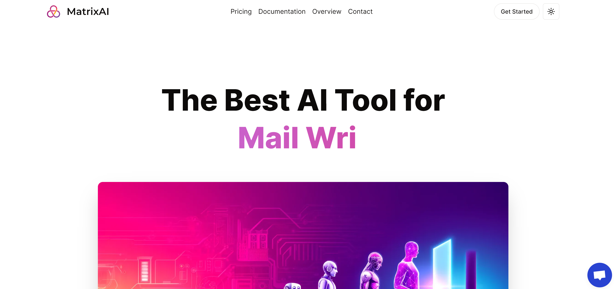

<div align="center" id="top" className="mb-10">


&#xa0;

  

<a href="https://jj-matrix-ai.vercel.app/">Demo</a>

</div>

# SaaS AI Platform

NextGen is a comprehensive SaaS AI Platform with a modern tech stack including Next.js 13, React, Tailwind CSS, Prisma, and Stripe. This platform is designed to offer a wide range of AI-powered tools, from image and video generation to music creation and conversational AI. Featuring a sleek Tailwind design, full responsiveness, and a variety of authentication methods, this platform is equipped to handle the needs of diverse users.

## Features

- **Stylish Interface:** Utilize Tailwind CSS for design, animations, and effects.
- **Responsive Design:** Ensures the platform works seamlessly across devices.
- **Authentication:** Supports Clerk Authentication, including email, Google, and 9+ social logins.
- **Form Validation:** Leverages react-hook-form for client-side form handling.
- **Error Handling:** Implements react-toast for server-side error feedback.
- **AI Tools:**
  - Image Generation with OpenAI.
  - Video Generation with Replicate AI.
  - Conversation Generation with OpenAI.
  - Music Generation with Replicate AI.
- **Subscription:** Integrates Stripe for monthly subscription management.
- **API Rate Limiting:** Implements a free tier with API usage limits.
- **Routing:** Demonstrates POST, DELETE, and GET routes in route handlers.
- **Server-Side Data Fetching:** Shows how to fetch data in server components directly from the database.
- **Component Relations:** Explains handling relations between server and child components.
- **Layout Reusability:** Guides on reusing layouts for a consistent UI.
- **Folder Structure:** Details the folder structure in a Next.js 13 App Router setup.

## Prerequisites

- Node.js version 18.x.x

## Getting Started

### Cloning the Repository

```bash
git clone https://github.com/jeffjiang13/NextGen.git
```

### Installing Dependencies

Navigate to the project directory and install the necessary packages:

```bash
npm install
```

### Running the Application

Start the development server with:

```bash
npm run dev
```

## Available Commands

Execute these commands using `npm run <command>` to manage the application:

| Command | Description                                |
|---------|--------------------------------------------|
| `dev`   | Starts the app in development mode.        |

---


## This Project is for Learning Purpose Only
This project is a personal endeavor and is not intended for commercial use. It serves as a learning tool to explore the capabilities of Next.js 13, React, and various AI technologies. The code and resources are provided as-is, without any warranties or guarantees. Use at your own risk.
